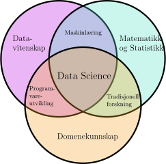

# Innføring i data science

De forelesningsnotatene kom ut av forelesningen [Innføring i data science](https://www4.uib.no/emner/INF161) ved Universitetet i Bergen. Det er en generell innføring i mange av emnene som til sammen utgjør data science. Data science er et veldig stort emne og det finnes allerede mange bøker om data science. Det finnes til og med mange bøker om hvert eneste av kapitlene i disse forelesningsnotatene. Målet med forelesningsnotatene er derfor ikke å være omfattende, men å gi en konsis innføring som omfatter hele data science prosessen. 


## Hva er data science?

Camberidge ordbok definerer data science som 

> Bruken av vitenskapelige metoder for å hente ut nyttig informasjon fra data, spesielt store mengder data.

På Wikipedia står det at 

> Data science er et tverrfaglig felt som bruker vitenskapelige metoder, prosesser, algoritmer og systemer for ̊a hente ut kunnskap og innsikt fra strukturerte og ustrukturerte data.

Begge definisjonene handler om å bruke *vitenskapelige metoder* for å hente ut *nyttig informasjon, kunnskap og innsikt* fra *data*. 
De forelesningsnotatene beskriver hva vi mener med data og gir en innføring i noen av de vitenskapelige metodene som brukes for å hente ut kunnskap og innsikt fra data.

Så hva slags vitenskapelige metoder er det vi snakker om? Data science er i skjæringspunktet mellom datavitenskap, matematikk og statistikk og domenekunnskap. 



I denne sammenhengen betyr dommenekunnskap kunnskap om domenen data kommer fra. Det vil si at hvis vi for eksempel jobber med medisinske data, så er det viktig å vite noe om medisin for å forstå hvordan vi skal analysere data og hva resultatene av dataanalyser faktisk betyr. Siden det er mange dommener som data science blir brukt i, så handler de forelesningsnotatene mest om skjæringspunktet mellom datavitenskap, matematikk og statistikk. 

Forelesningsnotatene er delt opp i åtte kapitler. Vi går ikke gjennom data science prosessen lineært fordi det ikke er mulig å lære seg god prosjektdesign uten å først kunne noe om data og forstå forskjellige måter å analysere data på. 

## Innhold
```{tableofcontents}
```
